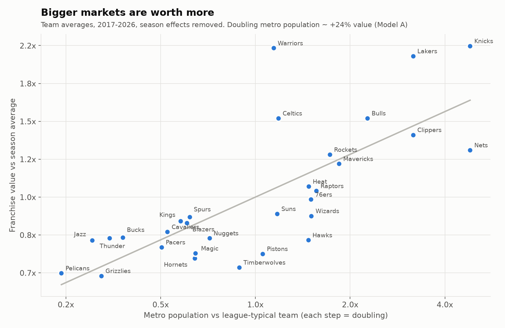

# NBA Franchise Valuation

What drives the value of an NBA franchise, and how do Forbes valuations compare with what teams actually sell for?

**[Live interactive dashboard](https://kellerzachary117.github.io/nba-franchise-valuation/)**

The project uses a panel of 30 teams over 10 seasons (2017-2026) with Forbes value, revenue, metro population, arena, winning and payroll data. It runs regressions on the panel, checks Forbes values against 8 real sale prices, and draws the results as static charts and an interactive dashboard.

## Findings

- **Market size dominates.** Doubling a team's metro population goes with about +24% franchise value. Market size alone explains 52% of the spread in value across teams. Winning explains 4%, arenas 10%, and all three together 58%.
- **Winning barely registers.** Within a team over time, win percentage and playoff success are not statistically significant. Each extra year of arena age is associated with about 0.3% lower value.
- **The whole league rose together.** Year effects alone explain about 60% of the variance in log value.
- **Teams sell for more than Forbes says.** The median control-sale premium over the Forbes list value is +21% (mean +25%, 7 control sales), ranging from -22% (Dallas) to +77% (Charlotte). The sale list is small and hand-picked, so treat the median as a rough signal.



## Repo layout

```
data/       panel.csv (the Panel tab of the workbook) and the source .xlsx
src/        nba_models.py, nba_sales_check.py, make_charts.py, make_dashboard.py
results/    saved script output (.txt) and charts/ (PNGs)
docs/       index.html, the interactive dashboard
```

## Run it

```
python3 -m venv .venv
.venv/bin/pip install -r requirements.txt
.venv/bin/python src/nba_models.py data/panel.csv
.venv/bin/python src/nba_sales_check.py data/panel.csv
.venv/bin/python src/make_charts.py data/panel.csv
.venv/bin/python src/make_dashboard.py data/panel.csv
```

The dashboard is hosted with GitHub Pages from the `docs/` folder. To view it locally, open `docs/index.html` in a browser. It loads its chart library (Plotly) from a CDN, so it needs an internet connection.

## Models

- **Model A (between teams):** log value on log metro population, win%, playoff score, arena age and arena ownership, with season fixed effects.
- **Model B (within teams):** log value on win%, playoff score and arena age, with team and season fixed effects.
- **Model C (revenue multiple):** log of value over revenue, on the same predictors as A, using non-COVID rows only.

Standard errors are clustered by team. Robustness checks drop the New York and Los Angeles teams, split population across shared markets, use a 3-season average win%, and swap arena age for a new-arena indicator.

## Data notes

Franchise values are Forbes estimates. Sale prices and agreement dates are hand-entered in `src/nba_sales_check.py`.
